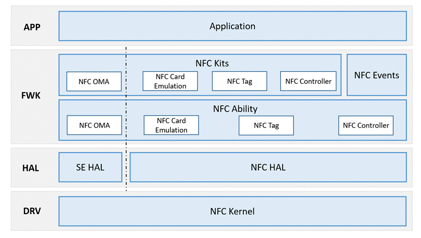

# NFC<a name="EN-US_TOPIC_0000001133207781"></a>

-   [Introduction](#section13587125816351)
-   [Architecture](#section13587185873516)
-   [Directory Structure](#section161941989596)
-   [Constraints](#section119744591305)
-   [Usage](#section1312121216216)
-   [Repositories Involved](#section1371113476307)

## Introduction<a name="section13587125816351"></a>

Near-field communication \(NFC\) is a non-contact identification and interconnection technology for short-distance wireless communication between mobile devices, consumer electronic products, PCs, and smart devices.

The NFC module provides NFC control, tag reading and writing, secure element access, card emulation, and NFC notification.

The  **NfcController**  class provides features such as NFC control and status query. Tag reading and writing are provided by a variety of tag subclasses that match different technologies or protocols. The  **SEService**  class provides access to secure elements on a device. The  **CardEmulation**  class provides methods for enabling and disabling card emulation.

## Architecture<a name="section13587185873516"></a>

**Figure  1**  NFC architecture<a name="fig4460722185514"></a>  




## Directory Structure<a name="section161941989596"></a>

The main code directory structure of Intelligent Soft Bus is as follows:

```
/foundation/communication
├── interfaces          # API code
│   └── kits           # APIs
│       └── nfckit    # NFC APIs
│           ├── java   # Implementation code for Java APIs
│           └── test   # Test code for Java APIs
├── services            # Service
│   └── nfc            # NFC services
│       ├── etc        # NFC service startup configuration
│       ├── include    # Header files
│       ├── src        # Source code
│       └── test       # Service test code
```

## Constraints<a name="section119744591305"></a>

-   **SEService**  can only be used on devices that have secure elements.
-   Devices can use off-host card emulation only if they have secure elements.

## Usage<a name="section1312121216216"></a>

（1） NFC control

Applications or other modules can implement the following functions related to card emulation through corresponding APIs:

1.  Check whether a device supports NFC.
2.  Enable or disable NFC on a device.

（2）Reading the tag type

1.  Obtain  **TagInfo**  from  **Intent**  and initialize the  **TagInfo**  instance.
2.  Call the  **getTagSupportedProfiles\(\)**  method to obtain the technologies or protocols supported by the tag.
3.  Call the  **isProfileSupported\(int profile\)**  method to check whether NFC-A, ISO-DEP, and MIFARE Classic are supported. If they are supported, use the  **TagInfo**  instance to create an NFC-A, ISO-DEP, or MIFARE Classic tag.
4.  Call different methods to access tags based on the tag technology type.

（3）Secure element access

Secure elements store important data. Applications or other modules can implement the following functions related to secure elements through corresponding APIs:

1.  Obtain the number of secure elements and their respective names.
2.  Check whether a secure element is available.
3.  Open a basic channel on the secure element.
4.  Open a logical channel on the secure element.
5.  Send Application Protocol Data Units \(APDUs\) to a secure element.

（4）Card emulation

Devices can function as NFC cards, such as access cards and bus cards.Applications or other modules can implement the following functions related to card emulation through corresponding APIs:

1.  Check whether card emulation is supported for a specified secure element, which can be a host card emulation \(HCE\), embedded Secure Element \(eSE\), or subscriber identity module \(SIM\).
2.  Enable or disable card emulation for a specified technology type and obtain the card emulation status.
3.  Obtain the method of selecting the service based on the NFC service type \(payment or other\).
4.  Register and unregister a preferred foreground application.
5.  Perform AID-related operations on NFC applications, including registering and removing AIDs for an application, checking whether an application is the default handler for a specified AID, and obtaining the AIDs of an application.
6.  Define the  **HostService**  and  **OffHostService**  abstract classes, which can be inherited by third-party applications to implement NFC card emulation.

## Repositories Involved<a name="section1371113476307"></a>

hmf/communication/nfc

