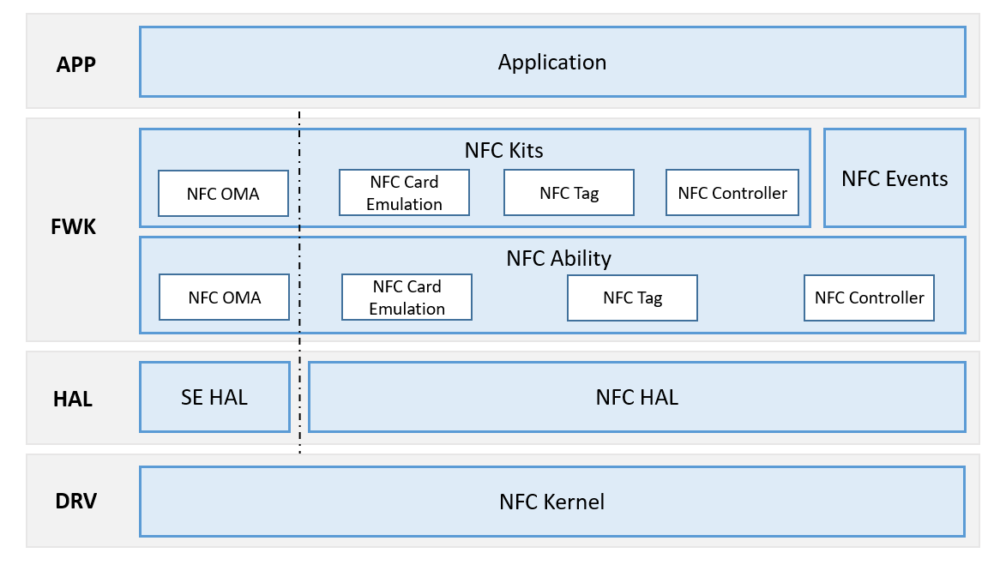

# NFC组件<a name="ZH-CN_TOPIC_0000001124412109"></a>

-   [简介](#section11660541593)
-   [系统架构](#section342962219551)
-   [目录](#section161941989596)
-   [约束](#section119744591305)
-   [说明](#section1312121216216)
    -   [使用说明](#section129654513264)

-   [相关仓](#section1371113476307)

## 简介<a name="section11660541593"></a>

近距离无线通信技术\(Near Field Communication，NFC\) ，是一种非接触式识别和互联技术，可以在移动设备、消费类电子产品、PC和智能设备间进行近距离无线通信。

OpenHarmony中NFC模块提供了NFC基础控制、Tag读写、安全单元访问、卡模拟以及NFC消息通知的功能。其中NfcController提供了对NFC开关控制及状态查询等功能，Tag读写功能由与技术或协议匹配的各个Tag子类提供，访问安全单元的功能由SEService提供，CardEmulation提供卡模拟能力。

## 系统架构<a name="section342962219551"></a>

**图 1**  NFC组件架构图<a name="fig444313176464"></a>  




<a name="table1716174620235"></a>
<table><thead align="left"></thead>
<tbody></tbody>
</table>

## 目录<a name="section161941989596"></a>

```
/foundation/communication/nfc
├── adapter             
│   ├── interfaces     # 平台适配代码
│   │   └── kits      # Java接口适配目录
│   │       └── nfc   # NFC组件接口的适配代码存放目录
│   └── services       # service适配目录
│       ├── include    # service适配头文件存放目录
│       └── src        # service适配源码存放目录
├── interfaces          # 接口代码
│   └── native_cpp           # 本地SDK库
│       ├── nfc_standard    # nfc sdk
│       │    ├── include   # 头文件
│       │    ├── src   # 源文件
│       │    └── test   # nfc sdk的单元测试及集成测试代码（ce_demo：HCE demo；nfc_ce_gtestcase：卡模拟集成测试脚本；testcase：nfc reader集成测试脚本；unittest：nfc sdk的单元测试）
│       ├── se_standard    # se sdk
│       │    ├── include   # 头文件
│       │    ├── src   # 源文件
│       │    └── test   # se sdk的单元测试及集成测试代码（sdk_case_test：se集成测试脚本；unittest：se sdk的单元测试）
│       └── osal    # OS能力抽象层
│           ├── include   # osal头文件
│           └── src   # osal源码
├── prebuilts          # 预编译
│   └── librarys       # 库
│       └── nfc_st    # 华为提供的ST库
│           ├── arm   # st库及相关依赖库
│           ├── etc   # 配置文件
│           └── include   # 库的头文件
└── services            # 子系统服务代码
    ├── nfc_standard    # nfc 服务
	│    ├── etc   # 系统服务配置
    │    ├── include   # 头文件
    │    ├── src   # 源文件
    │    └── test   # nfc 服务的单元测试（nfc_service：nfc服务手动加载程序；unittest：nfc 服务的单元测试）
    ├── se_standard    # SE服务
    │    ├── include   # 头文件
    │    ├── src   # 源文件
    │    └── test   # se 服务的单元测试（se_service：se服务手动加载程序；unittest：se 服务的单元测试）
    └── st_service    # st的HAL服务
	     ├── include   # st的HAL服务的头文件
         ├── src   # st的HAL服务的源码
         └── test   # st_se_server：st的HAL服务手动加载程序

```

## 约束<a name="section119744591305"></a>

1、 设备必须具备安全单元（Secure Element，简称为SE），才能使用SEService进行访问；

2、 设备必须具备安全单元， 才能使用OffHost的卡模拟类型。

## 说明<a name="section1312121216216"></a>

### 使用说明<a name="section129654513264"></a>

（1） NFC开关控制

应用或者其他模块可以通过接口完成以下功能：

1.  查询本机是否支持NFC能力。
2.  开启或者关闭本机NFC。

（2） 读取卡片类型

1.  从Intent中获取TagInfo，初始化TagInfo实例。
2.  TagInfo实例调用getTagSupportedProfiles\(\)接口查询当前Tag支持的技术或协议类型。
3.  调用isProfileSupported\(int profile\)接口查询是否支持NfcA、IsoDep、MifareClassic等类型。若支持，可使用TagInfo实例构造NfcATag、IsoDep、MifareClassic等实例。
4.  根据不同的Tag技术类型的实例，调用不同的API完成Tag的访问。

（3） 访问安全单元

安全单元可用于保存重要信息，应用或者其他模块可以通过接口完成以下功能：

1.  获取安全单元的个数和名称。
2.  判断安全单元是否在位。
3.  在指定安全单元上打开基础通道。
4.  在指定安全单元上打开逻辑通道。
5.  发送APDU（Application Protocol Data Unit）数据到安全单元上。

（4） 卡模拟功能

设备可以模拟卡片，替代卡片完成对应操作，如模拟门禁卡、公交卡等。应用或者其他模块可以通过接口完成以下功能：

1.  查询是否支持指定安全单元的卡模拟功能，安全单元包括HCE（Host Card Emulation）、ESE（Embedded Secure Element）和SIM（Subscriber Identity Module）卡。
2.  打开或关闭指定技术类型的卡模拟，并查询卡模拟状态。
3.  根据NFC服务的类型获取刷卡时选择服务的方式，包括支付（Payment）类型和非支付（Other）类型。
4.  动态设置和注销前台优先应用。
5.  NFC应用的AID相关操作，包括注册和删除应用的AID、查询应用是否是指定AID的默认应用、获取应用的AID等。
6.  定义Host和OffHost服务的抽象类，三方应用通过继承抽象类来实现NFC卡模拟功能。

## 相关仓<a name="section1371113476307"></a>

hmf/communication/nfc

